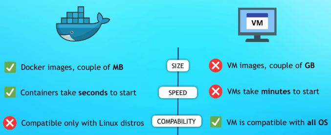
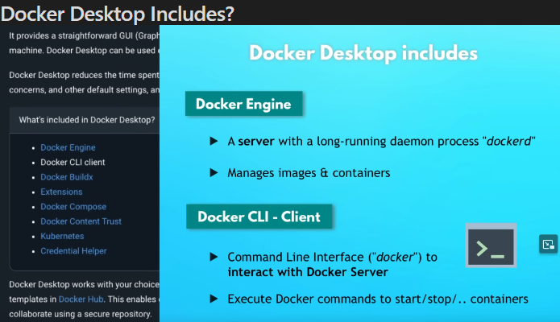

# Understand the Basics of Containers:
Containers are a lightweight, portable, and self-sufficient system for running an application, along with its dependencies, isolated from other processes.
## Key Concepts:
### Containers vs. Virtual Machines: 
- Containers share the host system’s kernel, while virtual machines include a full copy of an operating system.

#### Images and Containers: 
An image is a static snapshot of a container's setup, while a container is an instance of an image. ( --> To explain this a little "an image is like a toy box that has instructions and parts for building a specific toy" but when all these parts are build then it is a container <-- ).

# What is docker?
1) It is virtualization software that makes developing and deploying applications much easier. 
2) It Packages application with all the necessary dependencies, Environment Configuration, system tools and run time.
3) Portable artifact, easily shared and distributed.

## Why is Docker a big deal?
### With Containers: 
1) It standardizes process of running any service on any local dev Environment 
2) Easy to run different versions of same app without any conflicts.

## Advantages/Disadvantages of docker/Virtual machines?
1) 

## Docker Desktop Includes?

